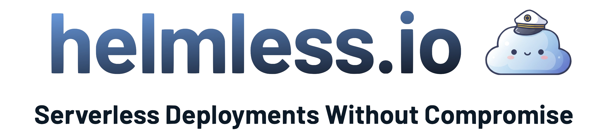

<a href="https://helmless.io" target="_blank">
  <picture>
    <source media="(prefers-color-scheme: dark)" srcset=".github/helmless_title.png">
    
  </picture>
</a>

# Google Cloud Run Example

This repository is an example of how to use Helmless to deploy a full application to Google Cloud Run.

It builds on and extends the [Helmless Quickstart Guide](https://helmless.io/docs/cloudrun/quickstart).

## 🌲 Structure

The repository is organized as follows:

- `terraform`: The GCP infrastructure as Terraform code.
- `helmless-chart`: The Helmless Helm application chart.
- `.github/workflows`: The Github Actions workflows for building and deploying the application.

